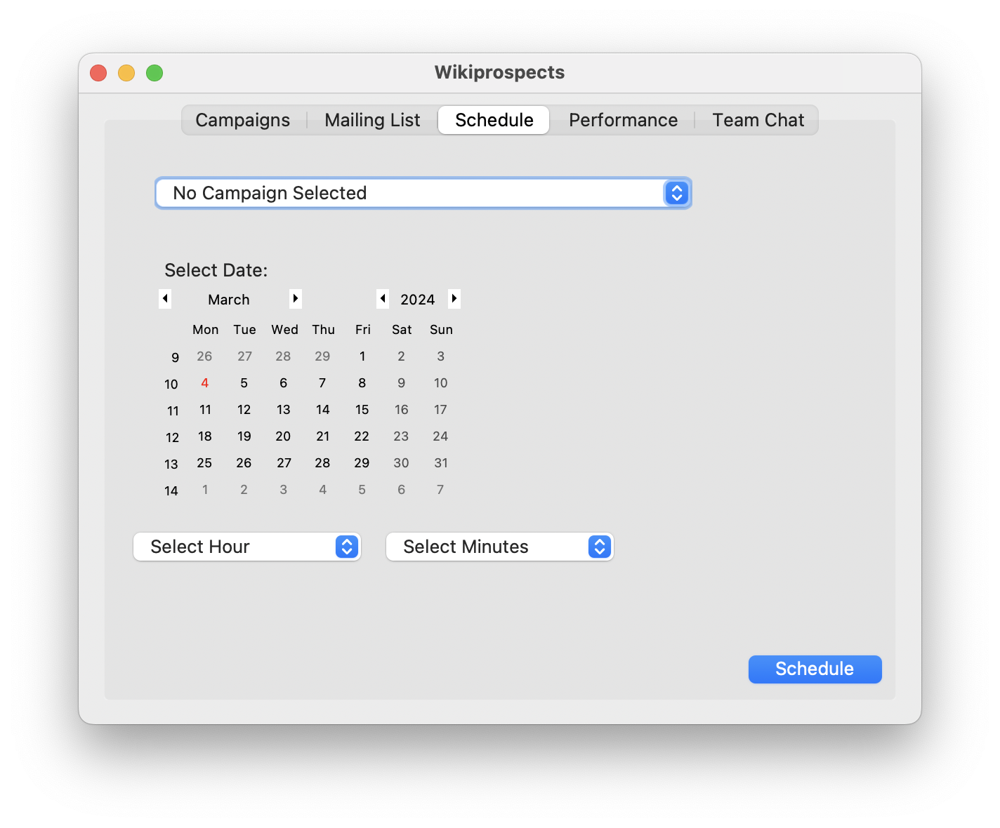

# 
Email Campaign Manager

:made by d33pster:

    <a href=='#Design'>Design</a>
    &nbsp;&nbsp;&nbsp;|&nbsp;&nbsp;&nbsp;
    <a href='#Usage'>Usage</a>
    &nbsp;&nbsp;&nbsp;|&nbsp;&nbsp;&nbsp;
    <a href='#Features'>Features</a>

#### About
This project was made during the Fix Factory Make-a-thon conducted by VIT Chennai during the month of March in 2024 specifically for M.Tech and MCA branches.

#### Problem Statement
###### 
Hackathon Challenge

Streamline Agency Email Marketting with a Centralized Platform  
We, Wikiprospects, are a high-growth marketing agency with 50 users managing our daily email workflow mannually. We lack a unified platform for organizing lists, designing campaigns, and tracking performance, leading to inefficiencies and inconsistencies. 
We're looking for your “Super intelligent” team to build the solution:
###### 
Unified Dashboard

Design a user-friendly dashboard for managing all email marketing activities, including contact lists, campaign creation, scheduling, and performance tracking with user and admin access.
###### 
Flexible Integrations

Develop seamless integrations with our existing Email Service Providers (SendGrid, Mailchimp, etc) via API connections. With flexibility for IMAP/POP for all the ISP (Yahoo, Gmail ,AOL , Microsoft, etc) future integrations is crucial.
###### 
Advanced List Management

Allow effortless segmentation, tagging, and suppression of email lists based on demographics, behavior, and opt-in/out preferences.
###### 
Campaign Workflow Automation

Implement tools for automated follow-up sequences, drag-and-drop email design, and template building.
###### 
In-depth Analytics

Build comprehensive reporting dashboards that track opens, clicks, conversions, and other key metrics across all campaigns and ESPs.
###### 
Collaborative Features

Integrate internal communication tools such as chat or annotations for better team collaboration on email campaigns.
###### 
Success Metrics

- Increased efficiency and campaign consistency.
- Improved email deliverability and engagement rates.
- Reduced manual effort and streamedlined workflow.
- Enhanced data visibility and actionable insights.
- Flexible and robust platform that adapts to our evolving needs.
###### 
Focus for your Hackathon Team

- Design an intuitive and user-friendly interface for managing all email marketing tasks.
- Craft seamless integrations with popular ESP APIs like Mailchimp, SendGrid, Constant Contact, etc. 
- Develop insightful reports and analytics dashboards with real-time data visualization.
- Ensure scalability and security for handling large volumes of data and email activities.
 
By building this centralized email marketing platform, you can empower us to achieve our marketing goals with greater efficiency, collaboration, and data-driven decision-making. We're excited to see your innovative solutions during the hackathon!

###### 
Important Note

We are not looking for the team to build the email sending technology itself. The focus is on creating a platform that integrates with existing ESPs and other email tools through API connections and simplifies workflow management for our agency.

#### Design
###### 
Tabs

###### 
Campaigns Tab

No Campaigns

Add Campaign
